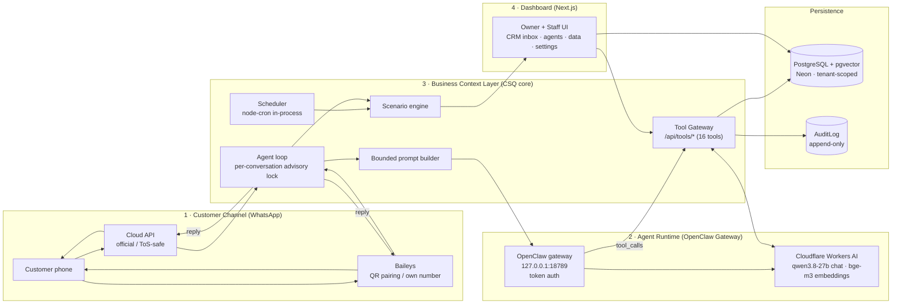
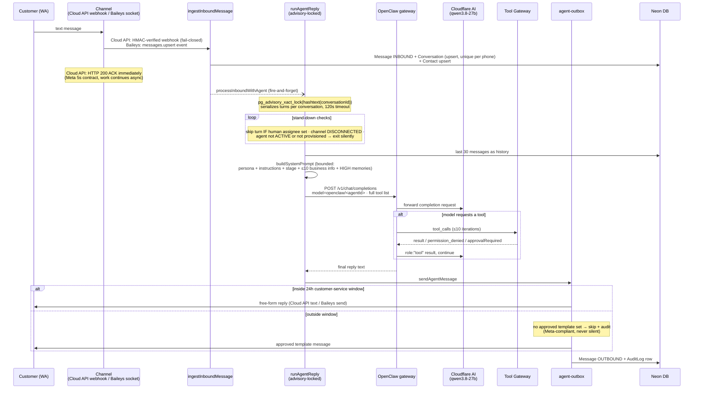
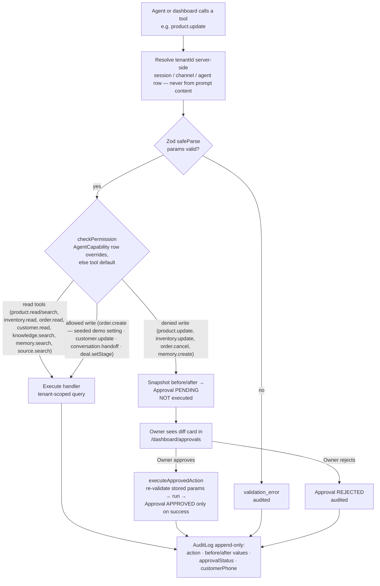
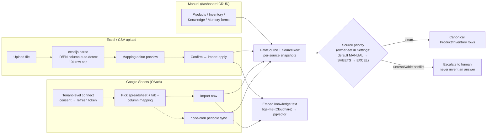
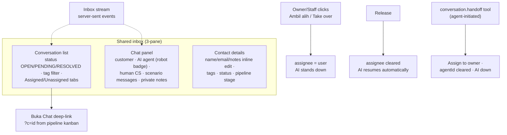
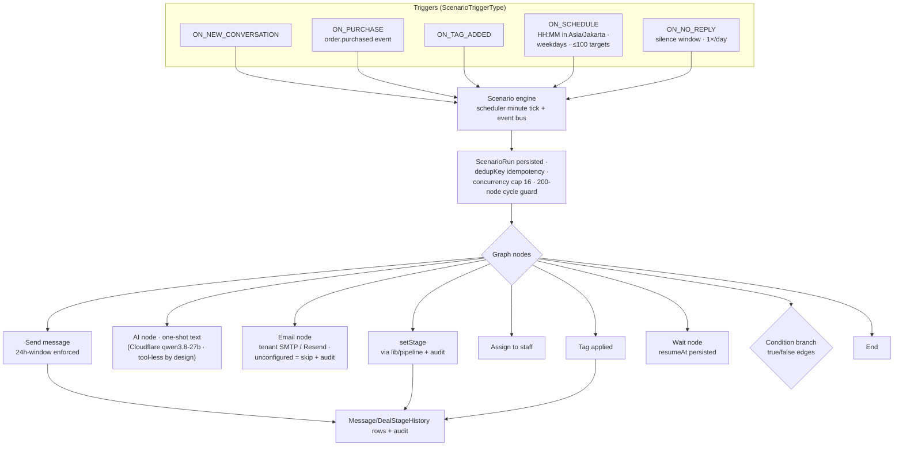
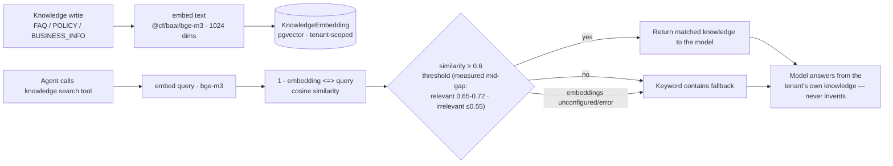
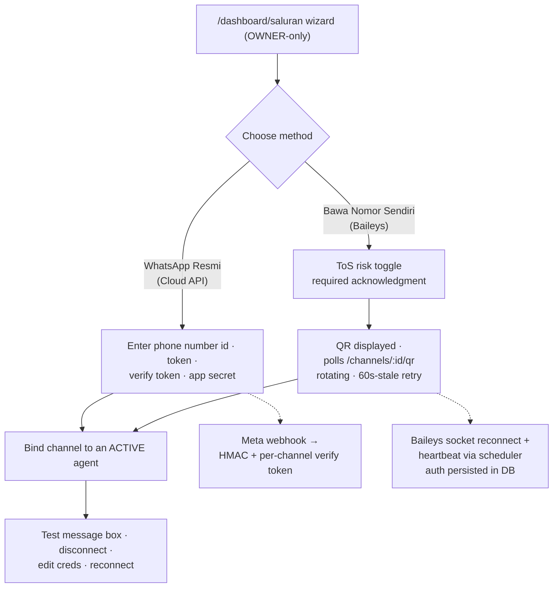
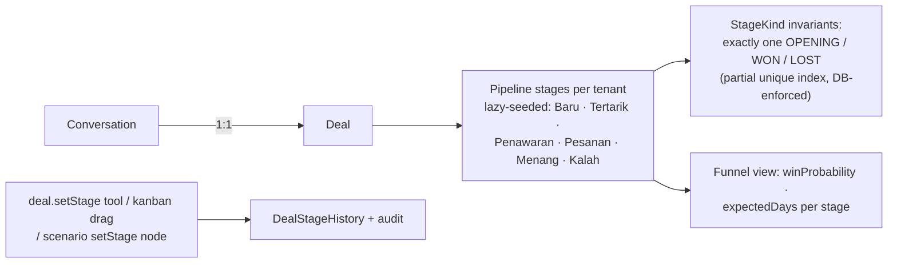
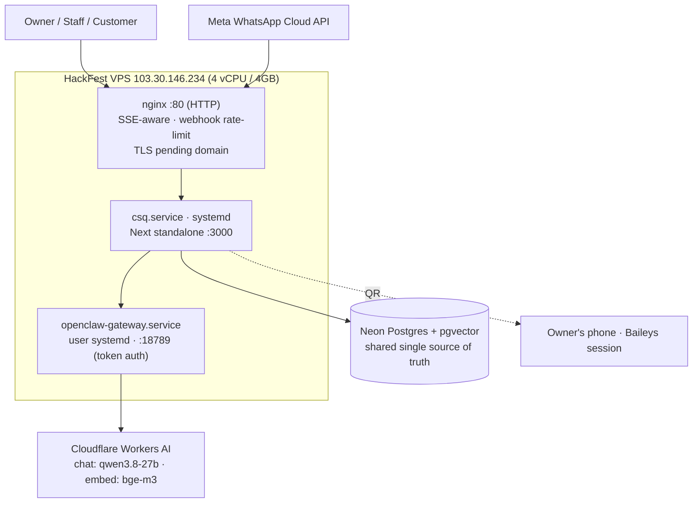

# CSQ — End-to-End Flow Diagrams (All Features)

Date: 2026-09-19 · Status: current as of commit `8c72e90` (Cloudflare Workers AI migration)
Scope: every user-facing + system flow in the platform. All diagrams are Mermaid — render on GitHub or any Mermaid viewer.

Legend: solid arrows = request/response · dashed arrows = async/background · 🔒 = permission-gated

---

## 1. Big-Picture Architecture (four layers)

**Multi-tenancy:** every table carries `tenant_id`; all queries filter server-side by the session/channel-resolved tenant (app-level guard live; Postgres RLS defined as second layer, not yet enforced).

---

## 2. Inbound WhatsApp Message → AI Reply (the core loop)

**Failure policy:** any error in the turn → logged + canned Bahasa fallback to the customer, never an error surfaced to Meta.

---

## 3. Tool Gateway — permission, approval, audit (every tool call)

**Safety moment (demo-critical):** a customer message can NEVER grant a write. "Kak, ubah harga jadi 50.000" → `product.update` is denied → the agent refuses and the write is audited.

---

## 4. Data Ingestion (three paths + conflict arbitration)

**Data authority:** every value tracks source, timestamp, last sync; conflicts resolve by owner-defined priority; unresolvable → human.

---

## 5. Human Collaboration — inbox, handoff, assignment (CRM)

**Roles:** OWNER manages settings/agents/approvals/team; STAFF works the inbox (routes enforce server-side, UI only reflects).

---

## 6. Scenario Automation (trigger → engine → actions)

**Builder:** React Flow canvas (`/dashboard/scenarios/[id]`) — node palette, drag-drop, per-node config, validation, activate/pause, run stats.

---

## 7. Knowledge & Semantic Search (bge-m3 + pgvector)

**Scaling rule:** knowledge is retrieved on demand, never bulk-loaded into the prompt — prompt size stays bounded regardless of tenant knowledge volume.

---

## 8. Channel Onboarding (pluggable WhatsApp)

**Device-limit answer:** one number, ALL CS serve via the web dashboard — Cloud API (any device) or one-time QR pairing (server holds the session; staff just use a browser).

---

## 9. Pipeline (deal tracking)

---

## 10. Deployment Topology (current — VPS, 2026-09-19)

**Known open items:** TLS + domain (required for Cloud API webhook) · Google Sheets redirect URI not yet registered for the VPS · RLS defined but not enforced (app-level tenant filter is the live guard).
