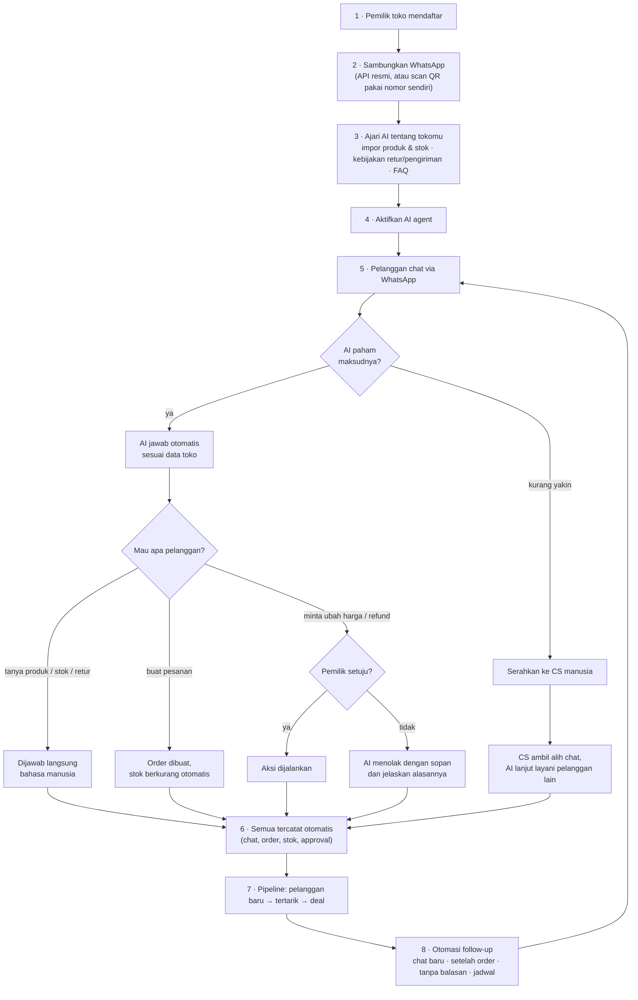

# CSQ — Alur Lengkap (Single Flow)

Satu diagram alur utuh CSQ — dari pemilik toko mendaftar sampai pelanggan jadi deal.
Sudut pandang pengguna, non-teknis. Gambar: `diagrams/csq-flow.png`.

```mermaid
flowchart TD
    A["1 · Pemilik toko mendaftar"] --> B["2 · Sambungkan WhatsApp<br/>(API resmi, atau scan QR pakai nomor sendiri)"]
    B --> C["3 · Ajari AI tentang tokomu<br/>impor produk & stok · kebijakan retur/pengiriman · FAQ"]
    C --> D["4 · Aktifkan AI agent"]

    D --> E["5 · Pelanggan chat via WhatsApp"]
    E --> F{"AI paham<br/>maksudnya?"}

    F -- "ya" --> G["AI jawab otomatis<br/>sesuai data toko"]
    F -- "kurang yakin" --> H["Serahkan ke CS manusia"]

    G --> I{"Mau apa pelanggan?"}
    I -- "tanya produk / stok / retur" --> J["Dijawab langsung<br/>bahasa manusia"]
    I -- "buat pesanan" --> K["Order dibuat,<br/>stok berkurang otomatis"]
    I -- "minta ubah harga / refund" --> L{"Pemilik setuju?"}

    L -- "ya" --> M["Aksi dijalankan"]
    L -- "tidak" --> N["AI menolak dengan sopan<br/>dan jelaskan alasannya"]

    H --> O["CS ambil alih chat,<br/>AI lanjut layani pelanggan lain"]

    J --> P["6 · Semua tercatat otomatis<br/>(chat, order, stok, approval)"]
    K --> P
    M --> P
    N --> P
    O --> P

    P --> Q["7 · Pipeline: pelanggan baru → tertarik → deal"]
    Q --> R["8 · Otomasi follow-up<br/>chat baru · setelah order · tanpa balasan · jadwal"]
    R --> E
```
