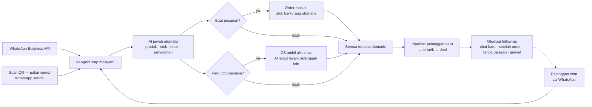

# CSQ — Alur Lengkap (Single Flow)

Satu diagram alur utuh CSQ, landscape, sudut pandang pengguna, non-teknis.
Gambar: `diagrams/csq-flow.png`.

```mermaid
flowchart LR
    W1["WhatsApp Business API"] --> S["AI Agent siap melayani"]
    W2["Scan QR — pakai nomor<br/>WhatsApp sendiri"] --> S

    C["Pelanggan chat<br/>via WhatsApp"] --> S

    S --> A["AI jawab otomatis<br/>produk · stok · retur · pengiriman"]
    A --> B{"Buat pesanan?"}
    B -- "ya" --> D["Order masuk,<br/>stok berkurang otomatis"]
    B -- "tidak" --> R
    A --> E{"Perlu CS manusia?"}
    E -- "ya" --> F["CS ambil alih chat,<br/>AI lanjut layani pelanggan lain"]
    E -- "tidak" --> R["Semua tercatat otomatis"]
    D --> R
    F --> R
    R --> G["Pipeline: pelanggan baru<br/>→ tertarik → deal"]
    G --> H["Otomasi follow-up<br/>chat baru · setelah order · tanpa balasan · jadwal"]
    H -.-> C
```
